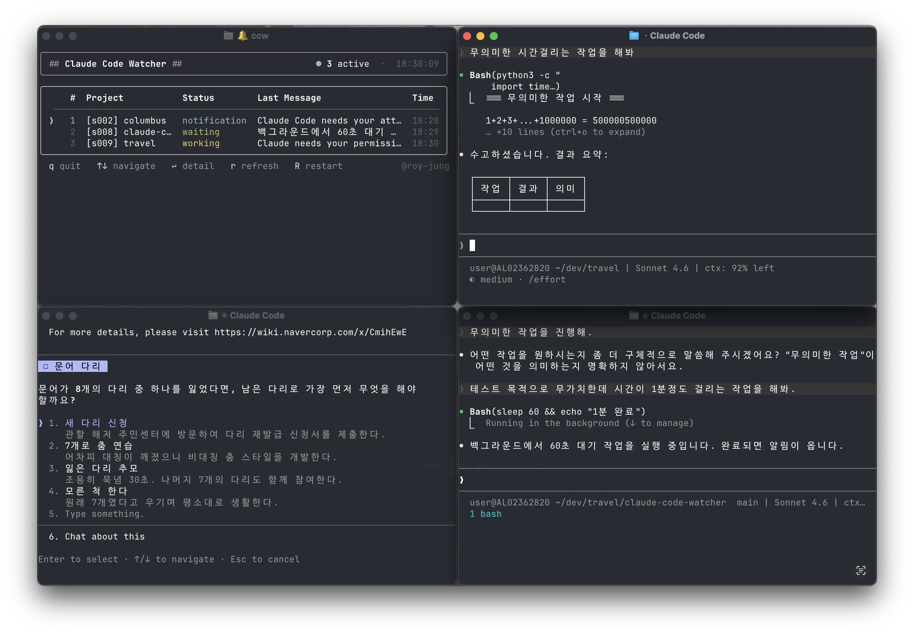

# claude-code-watcher (ccw)



VS Code 터미널에서 실행 중인 Claude Code 세션을 실시간으로 모니터링하는 CLI 대시보드입니다.

여러 개의 Claude Code 세션을 동시에 열어 두고 작업할 때, 각 세션의 현재 상태(작업 중 / 대기 중 / 알림)를 한 화면에서 확인할 수 있습니다.

## 기능

- **실시간 세션 목록** — 열려 있는 모든 Claude Code 세션의 상태를 TTY 오름차순으로 표시
- **상태 추적** — `working` / `waiting` / `notification` / `stale` 상태 자동 전환
- **서브에이전트 추적** — Agent 툴 실행 중인 서브에이전트 수 표시
- **알림** — `Stop`(응답 완료) 또는 `Notification`(권한 요청) 이벤트 발생 시 소리 알림 (사운드 커스터마이징 가능)
- **세션 상세보기** — 선택한 세션의 마지막 메시지, 경로, 타임스탬프 등 상세 정보
- **프로세스 재시작** — `R` 키로 대시보드 자체를 재실행

## 요구사항

- Node.js 18 이상
- Claude Code CLI

## 설치

```bash
npm i -g claude-code-watcher

# 훅 등록 (최초 1회)
ccw setup
```

`ccw setup`은 다음 작업을 수행합니다.

- `~/.claude/hooks/` 에 훅 스크립트 복사
- `~/.claude/settings.json` 에 Claude Code 라이프사이클 훅 등록
- `~/.claude/dashboard/active/` 디렉토리 생성

## 사용법

```bash
# 1. Claude Code 세션 시작 (프로젝트 디렉토리에서)
claude

# 2. 별도 터미널 탭에서 대시보드 실행
ccw
```

### 명령어

| 명령어 | 설명 |
|--------|------|
| `ccw` / `ccw start` | 인터랙티브 대시보드 실행 |
| `ccw setup` | 훅 설치 및 디렉토리 생성 |
| `ccw status` | 일회성 세션 목록 출력 |
| `ccw sessions` | 세션 목록 JSON 출력 |
| `ccw /sound` | 알림 사운드 설정 보기/변경 |
| `ccw help` | 도움말 출력 |

### 사운드 커스터마이징

알림 이벤트별로 macOS 시스템 사운드를 변경할 수 있습니다.

```bash
# 현재 설정 및 사용 가능한 사운드 목록 보기
ccw /sound

# Notification(권한 요청) 사운드 변경
ccw /sound noti Funk

# Stop(응답 완료) 사운드 변경
ccw /sound stop Blow
```

사용 가능한 사운드: `Basso`, `Blow`, `Bottle`, `Frog`, `Funk`, `Glass`, `Hero`, `Morse`, `Ping`, `Pop`, `Purr`, `Sosumi`, `Submarine`, `Tink`

설정은 `~/.claude/dashboard/config.json`에 저장되며, 대시보드 재시작 없이 즉시 적용됩니다.

### 대시보드 키 조작

| 키 | 동작 |
|----|------|
| `↑` / `↓` | 세션 선택 이동 |
| `Enter` | 상세보기 ↔ 목록 전환 |
| `r` | 데이터 새로고침 |
| `R` | 대시보드 프로세스 재시작 |
| `q` | 종료 |

## 세션 상태

| 상태 | 색상 | 설명 |
|------|------|------|
| `working` | 노랑 | Claude가 응답을 처리 중 |
| `waiting` | 초록 | 사용자 입력 대기 중 |
| `notification` | 청록 | 권한 요청 등 알림 발생 |
| `stale` | 회색 | 10분 이상 업데이트 없음 |
| `error` | 빨강 | 오류 발생 |

## 동작 원리

Claude Code의 라이프사이클 훅을 통해 세션 상태를 추적합니다.

```
Claude Code 이벤트 발생
       ↓
~/.claude/hooks/session-tracker.mjs 실행
       ↓
~/.claude/dashboard/active/<sessionId>.json 업데이트
       ↓
ccw 대시보드가 파일 변경 감지 → 화면 갱신
```

등록되는 훅 이벤트:

| 이벤트 | 전환 상태 |
|--------|-----------|
| `SessionStart` | `waiting` |
| `UserPromptSubmit` | `working` |
| `PreToolUse` / `PostToolUse` | `notification` → `working` 복원 |
| `Stop` | `waiting` + 알림 |
| `Notification` | `notification` (working 중일 때만) |
| `SubagentStart` / `SubagentStop` | 서브에이전트 목록 관리 |
| `SessionEnd` | 세션 파일 삭제 |

## 알려진 제한사항

### 사용자 인터럽트 미지원

Claude Code 응답 중 Esc 키로 취소("Interrupted · What should Claude do instead?")를 하면 **상태가 `working`으로 유지됩니다.**

현재 Claude Code 훅 API는 사용자 취소 이벤트를 제공하지 않습니다. `Stop` 훅은 자연 완료 시에만 발생하며, 인터럽트 시에는 발생하지 않습니다. 다음 프롬프트를 제출하면 `working` 상태로 정상 복귀합니다.

### 강제 종료 세션

Claude Code를 강제 종료(`kill`, 터미널 강제 닫기)하면 `SessionEnd` 훅이 실행되지 않아 세션 파일이 남을 수 있습니다. 대시보드 실행 시 프로세스 생존 여부를 자동으로 확인하여 정리합니다.


## 라이선스

MIT
